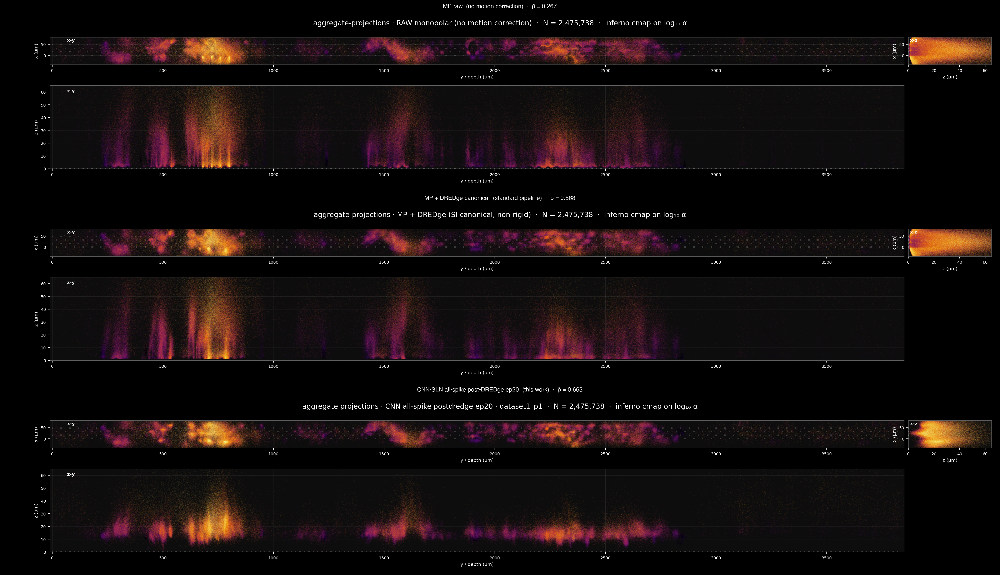
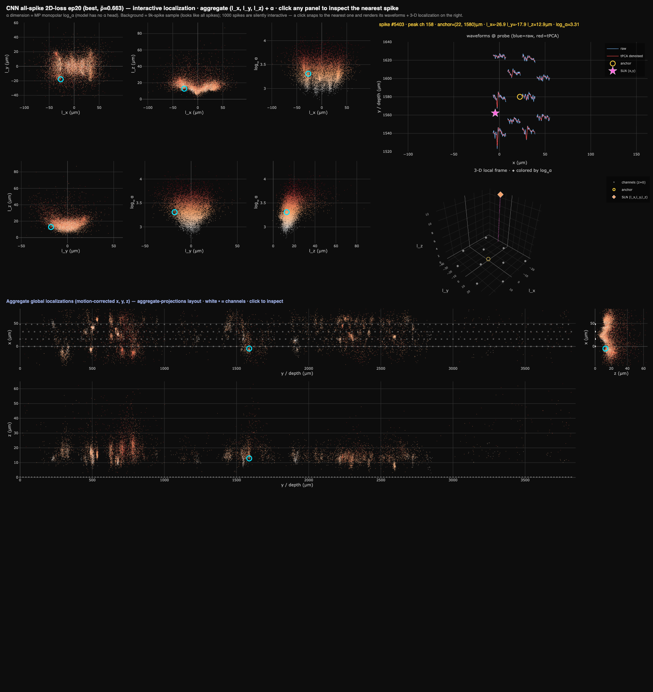

# Spike Localization Network (SLN)

Joint spike localization and motion drift correction for Neuropixels recordings,
solved via alternating optimization between a learned localization network
(CNN or Transformer) and the DREDge drift estimator.



*Aggregate spike projections (x-y, x-z, z-y) under three pipelines on
dataset1_p1, ~2.48 M spikes. Top: MP raw (no motion correction, ρ̄ = 0.267).
Middle: MP+DREDge canonical (standard pipeline baseline, ρ̄ = 0.568). Bottom:
the CNN-SLN all-spike post-DREDge ep20 result (this work, ρ̄ = 0.663,
+0.095 over the canonical baseline). The bottom row shows cleaner depth
bands than the middle one — motion-driven smearing is reduced.*

## TL;DR

Neuropixels recordings contain two confounded problems: (1) localizing each
spike's 3-D source position, and (2) correcting slow mechanical drift of the
probe. The standard pipeline solves them sequentially (monopolar localization
→ DREDge), which is suboptimal because drift biases localization and
localization errors corrupt drift estimates.

This repo implements a **joint solver**: a self-supervised Spike Localization
Network (SLN) is trained to predict per-spike positions whose drift-corrected
2-D histograms are temporally consistent (mean pairwise NCC ↑) and not
collapsed (mean spatial entropy ↑), with DREDge held fixed within each inner
phase and re-estimated between outer iterations.

On dataset1_p1 (NP 1.0, ~2.48 M spikes, 32.6 min) the best learned model
achieves **ρ̄ = 0.663 vs MP+DREDge's 0.568** (+0.095) — a 16.7% improvement
in temporal consistency without representational collapse.

See `docs/PROBLEM_STATEMENT.md` for the full problem framing and
`docs/COMPARISON.md` for the side-by-side scoreboard with file paths to every
visualization.

## Repo layout

```
spikeLocalizationNetwork/
├── src/                         core source (training, models, viz, utilities)
│   ├── relative_xyz_common.py  CNN-SLN model (RelativeXYZNet)
│   ├── transformer_sln.py      Transformer-SLN model (TransformerSLN)
│   ├── soft_histogram.py       differentiable 2-D Gaussian soft histogram
│   ├── histogram_losses.py     pairwise NCC, spatial entropy, tether loss
│   ├── dredge_wrapper.py       thin wrapper around spikeinterface's DREDge
│   ├── depth_raster.py         viz infrastructure (depth raster panels)
│   ├── aggregate_projections.py viz infrastructure (xy/xz/zy panels)
│   ├── localization_movie.py   viz infrastructure (per-second frames)
│   ├── window_video_common.py  recording loader
│   ├── train_relative_xyz_model.py  CNN supervised pretrain
│   ├── train_sln_dredge_iterative.py joint outer-loop trainer
│   ├── train_sln_postdredge.py frozen-motion fine-tune (CNN or TR)
│   ├── apply_sln_to_all_spikes.py CNN forward + motion correction over all spikes
│   ├── apply_transformer_sln_to_all_spikes.py  TR forward (no motion)
│   ├── apply_cnn_sln_raw_to_all_spikes.py      CNN forward (no motion)
│   ├── make_depth_raster.py            depth raster (color = log α)
│   ├── make_depth_raster_color_z.py    depth raster (color = z)
│   ├── make_xy_pairwise_correlation.py x-y pairwise NCC matrix
│   ├── make_spatial_entropy.py         spatial entropy H(t) trace
│   ├── make_aggregate_projections.py   x-y / x-z / z-y aggregate panels
│   ├── make_localization_movie.py      per-second mp4
│   ├── make_displacement_colormap.py   figT1: spike displacement vs baseline
│   ├── make_local_alpha_scatter.py     figT5: local coord scatter colored by α
│   ├── make_alpha_plots.py             α vs (x,y,z) + temporal variability
│   ├── make_mp_comparison_scatter.py   global + local scatter vs MP+DREDge
│   ├── make_dredge_motion_comparison.py 3 DREDge motion-field comparison
│   ├── make_convergence_trace.py       per-iteration training loss curve
│   ├── make_interactive_localization_html.py  interactive-visualizer (self-contained HTML)
│   └── run_dredge2_cnn_all_ep20.py     example: second-round DREDge runner
│
├── figures/
│   ├── per_method/   final viz package per method (depth raster, ncc, entropy,
│   │                 aggregate projections, alpha, figT1, figT5, …)
│   ├── comparison/   cross-method scatter + motion-field comparisons
│   └── interactive_visualizer.png   screenshot of the interactive-visualizer
│
└── docs/
    ├── PROBLEM_STATEMENT.md   the joint-localization-and-drift problem
    ├── COMPARISON.md          method scoreboard + viz coverage matrix
    └── scoreboard.csv         numerical metrics in CSV form
```

## Method

### Architecture

Two SLN variants are implemented:

| model | params | structure |
|---|---|---|
| **CNN-SLN** (`RelativeXYZNet`) | ~402K | 3 Conv1d blocks (BN, GELU, MaxPool) on the 10-channel waveform → Flatten → 3-layer MLP head producing (Δx, Δy, Δz) |
| **Transformer-SLN** (`TransformerSLN`) | ~580K | per-channel Linear(90→128) + row/col positional embeddings (5×2 NP-2.0 geometry; works for NP-1.0 too) → 4-layer pre-LN encoder, 8 heads, d=128 → mean-pool tokens, MLP, head → (Δx, Δy, Δz) |

Both predict offsets `(Δx, Δy, Δz)` from the channel-neighborhood centroid
("anchor") of the spike's peak channel.

### Training

1. **Supervised pretrain** — Huber-loss regression against monopolar (MP)
   localization targets. AdamW, 50 epochs, gives 30-35 μm 3-D RMSE.
2. **Joint optimization** — alternating block-coordinate descent for K=8
   outer iterations:
   - **Phase A (DREDge)**: run `spikeinterface.estimate_motion(method="dredge_ap")`
     on the SLN's current localizations. Treated as a black box.
   - **Phase B (SLN)**: for E inner epochs, update θ via gradient descent on
     `L(θ) = -λ_ρ·ρ̄(θ, T) - λ_H·H̄(θ, T) + λ_teth·L_teth(θ)` using a
     differentiable 2-D soft histogram (σ=4 μm Gaussian scatter on a 4 μm
     voxel grid). The drift field T is held fixed within each phase.

In practice with all-spike data, **one outer iteration with 20 inner SLN
epochs reaches the fixed point**: the second DREDge round produces a motion
estimate 99.7% correlated with the first (1.18 μm RMS difference) so further
outer iterations don't move the result. This is documented in
`figures/comparison/dredge_motion_comparison.png` and discussed in
`docs/COMPARISON.md`.

### Loss components

- **ρ̄ (pairwise NCC)** — primary objective. Mean normalized cross-correlation
  between drift-corrected soft 2-D histograms within a sliding temporal
  window (W=30 s). Rewards temporal consistency.
- **H̄ (spatial entropy)** — guard against representational collapse. Mean
  Shannon entropy of per-bin normalized histograms.
- **L_teth (tether)** — MSE between current and pretrained xy localizations.
  Prevents anatomically implausible solutions during joint optimization.

Weights: `λ_ρ=1.0, λ_H=0.1, λ_teth=0.01`. AdamW, lr=1e-4 (or 1e-5 for
fine-tune resumes), grad clip 5.0 (or 1.0 for resumes).

## Headline results — dataset1_p1

Drift-corrected mean pairwise NCC on the canonical 4 μm σ=4 soft histogram grid:

| method | apply ρ̄ | apply H̄ | Δρ̄ vs MP+DREDge |
|---|---|---|---|
| MP raw (no MC) | 0.267 | 6.27 | −0.301 |
| MP+DREDge canonical | 0.568 | 8.25 | 0 (baseline) |
| CNN-SLN 500K postd. ep20 | 0.528 | 8.06 | −0.040 |
| **CNN-SLN all-spike postd. ep20** | **0.663** | **8.14** | **+0.095** ← best |
| CNN-SLN all-spike ep20 + DREDge2 | 0.641 | 8.14 | +0.073 |
| TR-SLN 500K postd. ep5 | 0.571 | 8.21 | +0.003 |
| TR-SLN all-spike postd. ep2 | 0.641 | 8.19 | +0.073 |

Full per-axis Pearson ρ (global + local frame) and pipeline notes in
`docs/COMPARISON.md` and `docs/scoreboard.csv`.

Key empirical findings:

1. **Data scale > architecture.** Both 500K-subset-trained models (CNN, TR)
   underperform the MP+DREDge baseline; both all-spike-trained models beat
   it by +0.07-0.10 ρ̄. Architecture choice within the all-spike regime
   matters less than dataset coverage.
2. **z gets a free implicit gradient** through representation drift in the
   shared encoder layers. The z-row of the final `Linear(64→3)` receives
   zero gradient (z is not in the loss), but the shared backbone evolves
   under the (x,y) loss and changes the encoder features that the frozen
   z-row reads from. After 10 CNN epochs the shared layers shift ~23% in
   relative norm, producing noticeably "flatter" z distributions.
3. **One outer DREDge iteration is enough.** After 20 inner SLN epochs the
   model's raw outputs are consistent with DREDge1; running DREDge again
   yields a motion field 99.7% correlated (1.18 μm RMS) with DREDge1. Re-applying
   it to the same predictions slightly reduces ρ̄ (0.663 → 0.641) because
   the SLN training tuned residuals to be cancelled by DREDge1 *specifically*.

## Interactive visualizer



`src/make_interactive_localization_html.py` builds a **self-contained, clickable
HTML explorer** of a trained model's localizations (shown above for the
CNN all-spike 2D-loss ep20 model). Layout:

- **6 pairwise scatter panels** (top-left) of the per-spike local coordinates
  `(l_x, l_y, l_z)` + α, colored by log₁₀α on the canonical Inferno scale.
- **3 global aggregate panels** (bottom) — x-y / x-z / z-y in the exact
  `aggregate_projections` L-layout, with white channel-square markers.
- A dense background shows the full distribution; **1000 spikes are silently
  interactive**. Clicking any of the 9 panels snaps (pixel-accurate) to the
  nearest interactive spike and renders, on the right:
  - its **10-channel waveforms** at probe locations — raw (blue) + tPCA-denoised (red),
    with the channel-neighborhood anchor (○) and the SLN-estimated (x, y) (★);
  - a rotatable **3-D local frame** `(l_x, l_y, l_z)` with the channels at z=0,
    the anchor at the origin, and the SLN estimate ◆ colored by log₁₀α.

It is method-agnostic: point `--gl_pre` / `--global_dir` at any apply output and
set `--label`. A 4-output (CNN4D) model colors by *predicted* log₁₀α; a 3-output
model falls back to the MP monopolar log₁₀α. Plotly is loaded from a CDN; pass
`--svg` (with a small `--n_bg`) for an SVG render that avoids the browser's
WebGL-context limit (used to produce the screenshot above).

```bash
python3 src/make_interactive_localization_html.py \
    --gl_pre  <apply_dir>/GL_pre_dredge.npy \
    --global_dir <apply_dir> \
    --label "CNN all-spike 2D-loss ep20" \
    --out figures/interactive_localization_cnn_all_2d_ep20.html
# then open the HTML in any browser
```

## How to use this code

### Dependencies

See `requirements.txt`. Core: PyTorch ≥ 2.1, spikeinterface ≥ 0.103, numpy,
matplotlib, tqdm. Tested on Apple Silicon (MPS) and CPU; CUDA should work but
is untested in this repo.

### Reproducing a final-method viz package

This repo does NOT ship the raw recordings or intermediate `.npy` arrays
(per-spike waveforms, localizations, anchors — these are GBs each). You'll need:

1. **Raw data** — Neuropixels recording (e.g. `data/dataset1/`)
2. **Detection + waveform extraction** — produce `spike_times.npy`,
   `spike_channels.npy`, `spike_amplitudes.npy`, `spike_anchors.npy`,
   `waveforms_all.npy`, `channel_locations.npy`, `fs.npy`. (Use your favorite
   spike sorter's output for spike times + amplitudes; channel anchors are
   neighborhood centroids of the 10 nearest channels.)
3. **Monopolar localization** — produce `spike_locs_{x,y,z,alpha}.npy`. We
   used the SI implementation.
4. **Pretrain CNN/TR** — `python src/train_relative_xyz_model.py --dataset_dir <...>`
   or analogous for the Transformer
5. **Joint training** — `python src/train_sln_dredge_iterative.py ...` (outer
   loop with periodic DREDge) OR `python src/train_sln_postdredge.py ...`
   (frozen motion after a single DREDge round)
6. **Apply to all spikes** — `python src/apply_sln_to_all_spikes.py ...`
7. **Generate the viz package** — one `make_*.py` script per visualization
   (see the file list in the layout above)

For movies (skipped from this repo), regenerate via:

```bash
python src/make_localization_movie.py \
    --x_path <method>/x.npy --y_path <method>/y.npy --z_path <method>/z.npy \
    --corr_matrix_path xy_pairwise_corr_<method>.npy \
    --entropy_path spatial_entropy_<method>.npy \
    --motion_path <method>/motion.npz \
    --label "<method label>" --color "#..." \
    --frames_dir figures/localization_movie_<method>_frames \
    --out figures/localization_movie_<method>.mp4
```

For trained model checkpoints (skipped from this repo): contact the authors
or rerun the training pipeline from a pretrained CNN.

## Citation / paper

The method is described in a NeurIPS 2026 paper (in preparation). Citation
TBD upon acceptance.

## License

See `LICENSE` (MIT).
